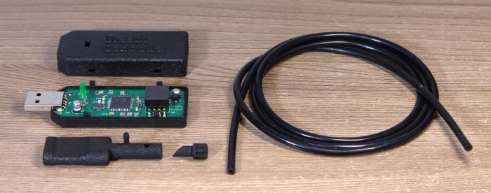
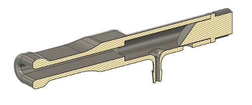
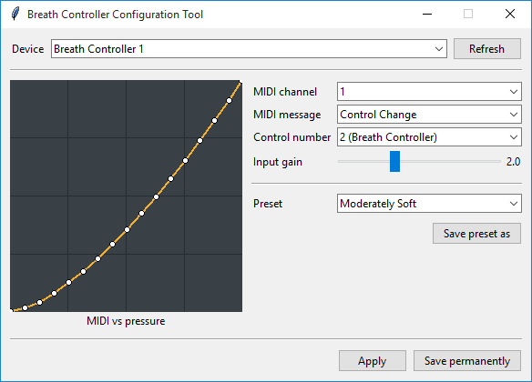

# USB-MIDI Breath Controller

A device that converts breath pressure to MIDI data.

The mouthpiece has an adjustable valve for drain control.

The LED's brightness is proportional to the output MIDI value.
Until the USB interface is successfully configured the LED is fully on.

During initialization, the auto-zeroing of the pressure sensor
is performed. So, don't blow into the mouthpiece when
plugging the device.

The mouthpiece and the case are 3D printed from STL files
in the `3d` directory. The silicone tube is 4 mm OD and 2 mm ID.

## Software

By default, the device sends the pressure data as CC2
messages on channel 1, with maximal input and output ranges,
and linear response. These settings can be changed using the
configuration tool (in the `software` directory).

The response curve can be edited by mouse: the left button
adds and drags points, the right button removes them, and the
middle button resets the curve to default. The curve can
be arbitrary.

The input gain is applied before the curve.

Settings can be applied to the device temporary (until power
is removed) or saved permanently (in EEPROM).

The software works on Windows and Linux (both tested), and
should work on macOS.

## Technical details

The device is implemented with ATmega16U4 MCU and
MPXV4006GP pressure sensor. The MCU has hardware USB controller,
ADC, EEPROM, and other peripherals, eliminating the need of additional
chips. In firmware, [LUFA](http://www.lufa-lib.org) USB stack is used.

The pressure is sampled by ADC, averaged for 8 ms, applied auto-zero,
input gain, the response curve, and then is sent to the
host if the value differs from the previously sent one.

The response curve is implemented by a 128-byte lookup table. 
It's simple and allows arbitrary curves.

The runtime configuration is implemented with SysEx messages (see below)
from the host. The configuration tool is written in Python using
[MIDO](https://mido.readthedocs.io) and Tkinter libraries.

### SysEx messages to configure the device

- Set the MIDI channel: `F0 7D 00 XX F7` where `XX` is a MIDI
channel (1..16).

- Set the MIDI message: `F0 7D 01 XX F7` where `XX` is `00` for Control Change,
`01` for Channel Pressure, `02` for Pitch Bend Up, `03` for Pitch Bend Down.

- Set the control number: `F0 7D 02 XX F7` where `XX` is a control number (0..127).

- Set the input gain: `F0 7D 03 XX F7` where `XX` is input gain multiplied
by 10. `XX` must be in range 10..40.

- Set the response curve: `F0 7D 04 X0 X1 ... X127 F7` where
`X0 X1 ... X127` is a 128-byte lookup table. Each `Xn` must be in the range 0..127.

- Save current settings to EEPROM: `F0 7D 05 F7`.

### Preset file format

Presets used by the configuration tool are just plain text files
containing following lines:

- `midi_channel` followed by a decimal number (1..16);
- `midi_message` followed by a `control_change`, `channel_pressure`, `pitch_bend_up`,
or `pitch_bend_down`;
- `control_number` followed by a decimal number (0..127);
- `input_gain` followed by a floating point decimal number
(between 1.0 and 4.0);
- `curve` followed by a space delimited list of points `(x,y)`
where `x` and `y` are decimal numbers (0..127), assuming
linear interpolation between the points.

You can ignore some of the settings, they will not changed after loading the
preset. For example, you can create curve-only presets.

Preset must have `.preset` file extension and lie in the
`software/presets` directory.

## Programming

ATmega16U4-AU is shipped with a pre-installed USB bootloader and can be
programmed with the official
[FLIP](https://www.microchip.com/DevelopmentTools/ProductDetails/PartNO/FLIP)
software or [dfu-programmer](https://dfu-programmer.github.io/). To enter the
bootloader short HWB pin to GND during reset (there are screwdriver-compatible
pads for that on the PCB). Just in case, the PCB has pogo-compatible pads for
ISP programming. The fuses are factory default.

## License

Unless otherwise noted, this work is licensed under Creative Commons Zero 1.0.

